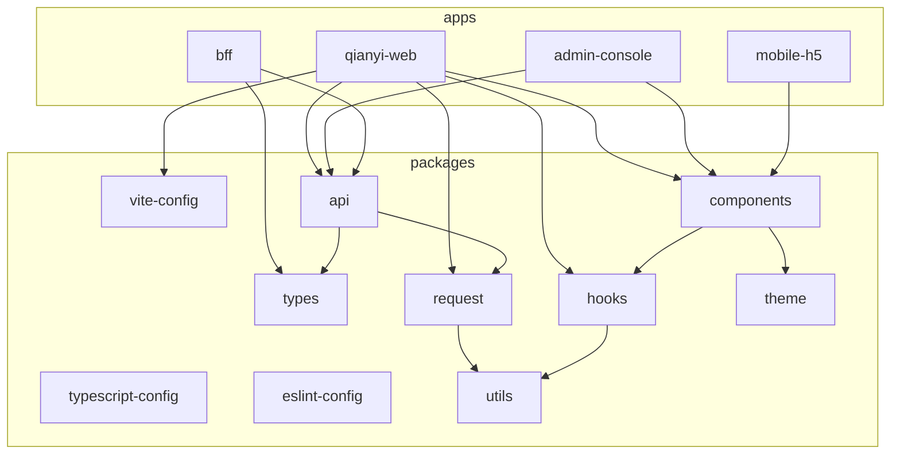

# 千易 UI Monorepo 升级计划

> **文档性质**：仅迁移规划与执行说明，不含实际代码改动。  
> **技术选型**：pnpm workspace + Turborepo + 共享 Vite 配置生态 + packages 独立构建（tsdown/tsup）+ 预留 BFF 层。  
> **当前基线**（2026-06-01）：单体仓库 `qianyi-ui`，根目录 `src/`（约 1188+ 页面视图、236+ API 模块），`pnpm-workspace.yaml` 仅含 `ignoredBuiltDependencies`，`apps/`、`packages/` 尚未落地。

---

## 1. 目标与原则

### 1.1 业务目标

| 目标 | 说明 |
|------|------|
| **多应用可独立部署** | 从单一 SPA 演进为 `apps/*` 多个前端产物，各自 `build` / `deploy`，共享底层能力包 |
| **共享能力下沉** | 组件、Hooks、工具、类型、请求层、构建配置抽到 `packages/*`，避免复制粘贴 |
| **构建与 CI 可扩展** | Turborepo 统一 `dev` / `build` / `lint`，支持缓存与 `--filter` 只构建变更包 |
| **预留 BFF** | 在 monorepo 内预留 `apps/bff`（或 `services/bff`）目录与任务，后续承接聚合接口、鉴权、文件代理等 |

### 1.2 非目标（本阶段不做）

- 不一次性拆完所有业务域为独立 app（仓库/FBM/集成等仍可先留在主应用内）
- 不强制上微前端（Module Federation / qiankun），除非后续单 app 体积仍不可控
- 不改变后端菜单/动态路由协议（`src/router/backEnd.ts` 逻辑可随主应用迁移，协议不变）

### 1.3 原则

1. **渐进迁移**：先搭骨架 → 主应用搬家 → 再抽共享包 → 再拆第二、第三个 app  
2. **每步可回滚**：每阶段独立分支，验证通过再合并  
3. **路径别名一次性规范**：统一 `@qianyi/*` workspace 包名，减少 `/@/` 与相对路径混用  
4. **锁文件唯一**：根目录单一 `pnpm-lock.yaml`，禁止子包各自 install  

---

## 2. 目标架构

### 2.1 目录结构（终态示意）

```text
qianyi-ui/                          # monorepo 根
├── apps/
│   ├── qianyi-web/                 # 主 ERP 前端（现有 src/ 整体迁入）
│   │   ├── src/
│   │   ├── index.html
│   │   ├── vite.config.ts          # 薄封装，引用共享配置
│   │   ├── package.json
│   │   └── tsconfig.json
│   ├── admin-console/              # 【阶段三可选】管理/运维类独立端
│   ├── mobile-h5/                  # 【阶段三可选】移动端 H5
│   └── bff/                        # 【预留】Node BFF（Nitro/Hono/Express 择一）
│       ├── src/
│       └── package.json
├── packages/
│   ├── typescript-config/          # 共享 tsconfig 片段
│   ├── eslint-config/              # 共享 ESLint 配置（从根 .eslintrc 抽离）
│   ├── vite-config/                # 由 config/vite-config 迁入并发布为 workspace 包
│   ├── types/                      # @qianyi/types 全局类型、API 响应泛型
│   ├── utils/                      # @qianyi/utils 纯工具函数
│   ├── request/                    # @qianyi/request axios 实例、拦截器
│   ├── api/                        # @qianyi/api 按域划分的 API 定义（从 src/api 逐步迁出）
│   ├── hooks/                      # @qianyi/hooks useTable 等
│   ├── components/                 # @qianyi/components 跨应用 UI
│   ├── theme/                      # @qianyi/theme Element Plus 主题
│   └── i18n/                       # 【可选】@qianyi/i18n 公共文案
├── config/                         # 过渡期可保留，最终合并进 packages/vite-config
├── scripts/                        # 根级编排脚本（逐步改为 turbo 调用）
├── turbo.json
├── pnpm-workspace.yaml
├── package.json                    # 根：private、scripts、devDependencies 工具链
├── pnpm-lock.yaml
└── plan.md                         # 本文档
```

### 2.2 依赖关系（逻辑）



### 2.3 包命名约定

| 位置 | `package.json` name | 引用方式 |
|------|---------------------|----------|
| 主应用 | `@qianyi/web` | `pnpm --filter @qianyi/web dev` |
| 共享包 | `@qianyi/components` 等 | `"@qianyi/components": "workspace:*"` |
| 配置包 | `@qianyi/vite-config` | devDependency + `import { getConfig } from '@qianyi/vite-config'` |

---

## 3. 阶段总览

| 阶段 | 名称 | 产出 | 风险 |
|------|------|------|------|
| **0** | 准备与摸底 | 模块边界清单、分支策略 | 低 |
| **1** | Monorepo 骨架 | workspace + turbo + 空 app/包 | 低 |
| **2** | 主应用搬迁 | `apps/qianyi-web` 可 dev/build | **高** |
| **3** | 配置包下沉 | `@qianyi/vite-config`、ts/eslint 共享 | 中 |
| **4** | 运行时共享包 | types/utils/request → components/hooks | 中 |
| **5** | API 包拆分 | `@qianyi/api` 按域迁移 | 中 |
| **6** | 第二应用 + BFF 预留 | admin 或 h5 壳 + `apps/bff` 脚手架 | 中 |
| **7** | CI/CD 与文档 | pipeline、发布说明 | 低 |

**建议周期**（人力 1–2 前端）：阶段 0–2 约 1–2 周；阶段 3–5 约 2–4 周；阶段 6–7 按业务排期。

---

## 4. 阶段 0：准备与摸底

### 4.1 执行步骤

| 步骤 | 操作 | 说明 |
|------|------|------|
| 0.1 | 创建迁移分支 `feat/monorepo-scaffold` | 与主干隔离，便于 PR 评审 |
| 0.2 | 统计耦合点 | 记录 `src/` 内跨域 import Top 路径（如 views → 其他域 components） |
| 0.3 | 列出环境变量清单 | `.env`、`.env.development`、`VITE_*` 全文档化 |
| 0.4 | 确认部署方式 | 现有 `scripts/deploy.mjs`、`build` 产出 zip/html 结构，写入迁移验收标准 |
| 0.5 | 与后端对齐 | 动态路由、OAuth、多 `VITE_ADMIN_PROXY_INFO` 端口是否仍只服务主应用 |

### 4.2 验收标准

- [ ] 《模块边界表》：至少划分 `admin` / `warehouse` / `fbm` / `integrations` / `product` / `financial` / `shared`
- [ ] 《禁止循环依赖规则》：apps 不可互相依赖；packages 不可依赖 apps
- [ ] 团队确认：第一期只上线 **一个** 可部署 app（`qianyi-web`），其余为目录占位

### 4.3 回滚

删除分支即可，无代码变更。

---

## 5. 阶段 1：Monorepo 骨架（pnpm + Turborepo）

> 本阶段只改**根配置与空目录**，不移动 `src/`。

### 5.1 执行步骤

#### 步骤 1.1：配置 `pnpm-workspace.yaml`

在现有 `ignoredBuiltDependencies` 基础上增加：

```yaml
packages:
  - 'apps/*'
  - 'packages/*'
```

保留原有：

```yaml
ignoredBuiltDependencies:
  - esbuild
```

**说明**：`apps/*`、`packages/*` 与 pnpm 10 一致；若 BFF 放在 `services/bff`，则增加 `'services/*'`。

#### 步骤 1.2：调整根 `package.json`

- `"private": true`
- `"name": "qianyi-monorepo"`（或保留 `qianyi-ui`）
- 将**应用级** `dependencies`（vue、element-plus 等）暂缓下移到 `apps/qianyi-web`（阶段 2 再移）
- 根 `scripts` 改为 turbo 代理，例如：
  - `"dev": "turbo run dev --filter=@qianyi/web"`
  - `"build": "turbo run build"`
  - `"lint": "turbo run lint"`
- 根保留：husky、commitlint、prettier、eslint、typescript、turbo

#### 步骤 1.3：安装 Turborepo

```bash
pnpm add -D turbo -w
```

#### 步骤 1.4：新增 `turbo.json`

建议初始任务（按包 `package.json` 的 scripts 透传）：

| 任务 | dependsOn | outputs | 说明 |
|------|-----------|---------|------|
| `build` | `^build` | `dist/**` | 先构建依赖包再构建 app |
| `dev` | 无 | 无 cache | `persistent: true` |
| `lint` | `^build` 可选 | 无 | 可先不依赖 build |
| `typecheck` | `^build` | 无 | `vue-tsc` / `tsc` |

**说明**：`^build` 表示 workspace 依赖包先执行 build，适配 packages 独立产出 `dist`。

#### 步骤 1.5：创建占位包

为每个未来将抽离的 package 创建最小 `package.json`：

```json
{
  "name": "@qianyi/types",
  "version": "0.0.0",
  "private": true,
  "type": "module",
  "exports": { ".": "./src/index.ts" },
  "scripts": {
    "build": "tsdown",
    "dev": "tsdown --watch"
  }
}
```

**说明**：阶段 1 可用 `exports` 指向源码；阶段 4 再切到 `dist` + `types` 字段。

#### 步骤 1.6：创建 `apps/qianyi-web` 占位

- 空 `src/main.ts`（临时）
- `package.json`：`name: "@qianyi/web"`，`scripts.dev/build/lint`
- 暂不删除根 `src/`（阶段 2 再迁）

#### 步骤 1.7：锁定依赖

```bash
pnpm install
```

### 5.2 验收标准

- [ ] `pnpm install` 无报错
- [ ] `pnpm turbo run build --dry-run` 能解析到各包
- [ ] 根目录仅一份 `pnpm-lock.yaml`

### 5.3 回滚

还原 `pnpm-workspace.yaml`、`package.json`，删除 `turbo.json` 与 `apps/`、`packages/` 占位。

---

## 6. 阶段 2：主应用搬迁（`src/` → `apps/qianyi-web/`）

> **风险最高阶段**：路径、别名、env、index.html、husky 路径全部受影响。

### 6.1 执行步骤

#### 步骤 2.1：物理迁移清单

从根目录迁入 `apps/qianyi-web/`：

| 原路径 | 新路径 |
|--------|--------|
| `src/` | `apps/qianyi-web/src/` |
| `index.html` | `apps/qianyi-web/index.html` |
| `vite.config.ts` | `apps/qianyi-web/vite.config.ts` |
| `public/`（若存在） | `apps/qianyi-web/public/` |
| `.env*`（应用级） | `apps/qianyi-web/.env*` 或根目录保留并由脚本指定 `envDir` |

**保留在根目录**（过渡期）：

- `scripts/`（后续改为调用 turbo）
- `husky/`、`.husky`
- `commitlint.config.js`、`.prettierrc.js`、`.eslintrc.js`
- `docker/`（若有）
- `AGENTS.md`

#### 步骤 2.2：`apps/qianyi-web/package.json`

- 从根 `package.json` **剪切**所有 `dependencies` / 应用相关 `devDependencies` 到 app 包
- `scripts`：
  - `"dev": "node ../../scripts/dev.mjs"` → 最终改为 `vite` 或相对 `scripts` 适配 `cwd`
  - `"build": "node ../../scripts/build.mjs"`（`build.mjs` 需支持 `--root apps/qianyi-web` 参数，**阶段 2 实施时修改**）
  - `"lint": "eslint src --ext .ts,.tsx,.vue && vue-tsc --noEmit"`

#### 步骤 2.3：路径别名

| 现别名 | 迁移后 |
|--------|--------|
| `/@/*` → `src/*` | 在 `apps/qianyi-web/tsconfig.json` 中改为 `["./src/*"]` 或保留 `/@/*` 仅指向 app 内 src |
| 引用共享包 | `@qianyi/components` 等 workspace 协议 |

`config/vite-config/src/utils/alias.ts` 在阶段 3 改为读取 app 根路径 + workspace 包。

#### 步骤 2.4：更新 `index.html`

```html
<script type="module" src="/src/main.ts"></script>
```

路径相对于 `apps/qianyi-web` 不变，但 Vite `root` 必须设为该目录。

#### 步骤 2.5：调整脚本 `cwd`

| 脚本 | 调整要点 |
|------|----------|
| `scripts/dev.mjs` | `process.cwd()` 改为 app 目录，或接受 `--app @qianyi/web` |
| `scripts/build.mjs` | `resolve(root, outDir)` 的 `root` 指向 app |
| `scripts/deploy.mjs` | 部署产物路径改为 `apps/qianyi-web/dist` 或统一 `dist` |
| `lint-staged` | 路径从 `./src` 改为 `apps/qianyi-web/src` 或用 `pnpm --filter` |

#### 步骤 2.6：根 `package.json` 精简

根仅保留 workspace 工具链与 `turbo` 脚本；业务依赖全部在 `@qianyi/web`。

#### 步骤 2.7：验证命令

```bash
pnpm install
pnpm --filter @qianyi/web dev
pnpm --filter @qianyi/web build
pnpm --filter @qianyi/web lint
```

### 6.2 验收标准

- [ ] 登录、首页、任意 3 个核心业务模块（建议：仓库列表、FBM 订单、系统集成页）功能正常
- [ ] 多端口 `pnpm devAll` / `VITE_ADMIN_PROXY_INFO` 仍可用
- [ ] 生产构建 zip 结构与现网一致（`html/` 目录层级）
- [ ] `pnpm commit` + husky lint-staged 通过

### 6.3 回滚

保留原分支；或把 `apps/qianyi-web/src` 移回根 `src/` 并恢复根 `package.json`。

---

## 7. 阶段 3：共享构建与规范包（Vite / TS / ESLint）

### 7.1 执行步骤

#### 步骤 3.1：迁移 `config/vite-config` → `packages/vite-config`

| 项 | 说明 |
|----|------|
| 包名 | `@qianyi/vite-config` |
| 入口 | `export { getConfig } from './src/index.ts'` |
| 构建 | 阶段 3 可不打包，app 直接 `workspace:*` 引用源码；稳定后用 tsdown 产出 |
| 依赖 | `vite`、`@vitejs/plugin-vue` 等列为 `peerDependencies` |

`apps/qianyi-web/vite.config.ts` 示例形态：

```ts
import { defineConfig } from 'vite';
import { getConfig } from '@qianyi/vite-config';

export default defineConfig((env) => getConfig(env, { appRoot: import.meta.dirname }));
```

**说明**：`getConfig` 需新增 `appRoot` 参数，用于解析 alias、envDir、`outDir`。

#### 步骤 3.2：`packages/typescript-config`

- `base.json`、`vue-app.json`、`library.json`
- 各 app/package `extends` 对应片段

#### 步骤 3.3：`packages/eslint-config`

- 从根 `.eslintrc.js` 抽共享 rules
- app 内 `.eslintrc.cjs`：`extends: ['@qianyi/eslint-config/vue-app']`

#### 步骤 3.4：删除冗余 `config/vite-config`

确认无引用后删除或保留软链接过渡期 1 个迭代。

### 7.2 验收标准

- [ ] 两个 app 复用同一 `getConfig` 时，仅 `appRoot` 不同即可启动
- [ ] `build:analyze`、压缩、zip 插件行为与迁移前一致

---

## 8. 阶段 4：运行时共享包（独立构建）

### 8.1 推荐抽离顺序

```text
types → utils → request → hooks → theme → components → api（部分）
```

**原因**：自下而上，避免 components 与 api 循环依赖。

### 8.2 各包职责与构建

| 包 | 职责 | 构建工具 | exports |
|----|------|----------|---------|
| `@qianyi/types` | `IApiResponse`、分页、通用枚举 | tsdown | `dist/index.js` + `dist/index.d.ts` |
| `@qianyi/utils` | 无 Vue 依赖工具 | tsdown | 同上 |
| `@qianyi/request` | `request.ts`、拦截器、错误处理 | tsdown | 同上 |
| `@qianyi/hooks` | `useTable` 等 | tsdown + vue 为 peer | 同上 |
| `@qianyi/theme` | Element 变量、tailwind 入口 | tsdown 或纯 css | 同上 |
| `@qianyi/components` | 表格、上传、TableFormModule 等 | tsdown + vue SFC | 子路径 exports 可选 |

#### 步骤 4.1：配置 tsdown（每 package）

- `tsconfig.json` extends `@qianyi/typescript-config/library.json`
- `package.json`：

```json
{
  "main": "./dist/index.js",
  "module": "./dist/index.js",
  "types": "./dist/index.d.ts",
  "exports": {
    ".": {
      "types": "./dist/index.d.ts",
      "import": "./dist/index.js"
    }
  },
  "scripts": {
    "build": "tsdown",
    "dev": "tsdown --watch"
  }
}
```

#### 步骤 4.2：app 消费方式

- **开发**：Vite `resolve.dedupe` + `optimizeDeps.include` 包含 `@qianyi/*`；可对 packages 使用 `server.fs.allow` 访问上级目录
- **生产**：依赖 `dist`，turbo `build` 先构建 packages

**可选加速**：开发态 `exports` 临时指向 `./src/index.ts`，CI/发布指 `dist`（通过 `publishConfig` 或环境变量切换）。

#### 步骤 4.3：迁移策略（每个包）

1. 复制文件到 `packages/xxx/src`
2. 修正 import 路径
3. app 内全局替换 `from '/@/utils/...'` → `from '@qianyi/utils'`
4. `pnpm --filter @qianyi/xxx build`
5. 跑 app lint + 抽 5 个页面冒烟

### 8.3 验收标准

- [ ] 删除 app 内已迁移的重复文件
- [ ] `turbo run build` 全绿
- [ ] 包体积：主应用 chunk 不显著增大（tree-shaking 正常）

---

## 9. 阶段 5：`@qianyi/api` 按域拆分

### 9.1 结构建议

```text
packages/api/
├── src/
│   ├── admin/
│   ├── warehouse/
│   ├── fbm/
│   ├── integrations/
│   ├── product/
│   └── index.ts          # 统一 re-export（可选，注意 tree-shaking）
├── package.json
└── tsdown.config.ts
```

### 9.2 执行步骤

| 步骤 | 操作 |
|------|------|
| 5.1 | 先迁 `request` 依赖稳定的域（如 `admin/user`） |
| 5.2 | views 内 import 改为 `@qianyi/api/warehouse` 子路径 export |
| 5.3 | 保留 mock、`.md` 文档随 api 同目录 |
| 5.4 | 每迁一域，跑该域 2–3 个列表页回归 |

### 9.3 注意

- API 文件之间的交叉引用需先下沉到 `types` / `utils`
- 生成脚本 `scripts/generate-kingdee-api.mjs` 输出路径改为 `packages/api/src/...`

---

## 10. 阶段 6：多应用与 BFF 预留

### 10.1 第二前端应用（示例：`admin-console`）

| 步骤 | 说明 |
|------|------|
| 6.1 | `pnpm create vite` 或复制 `qianyi-web` 最小壳 |
| 6.2 | 依赖 `@qianyi/components`、`@qianyi/request`、`@qianyi/vite-config` |
| 6.3 | 路由仅挂载管理域页面（从 `qianyi-web` **复制或逐步迁移** views，不要双份长期维护） |
| 6.4 | 独立 `VITE_*` 与部署域名；turbo：`turbo run build --filter=@qianyi/admin-console` |

**拆分判定**（满足其一再拆 app）：

- 独立域名与独立发布节奏
- 打包体积 &lt; 主应用 30% 且团队独立维护
- 安全隔离（如仅内网 VPN）

### 10.2 BFF 预留（`apps/bff`）

| 项 | 建议 |
|----|------|
| 运行时 | Node 20+，框架可选 **Nitro**（与 Vite 生态近）或 **Hono**（轻量） |
| 首期能力 | 健康检查 `/health`、统一代理 `/api/*`、上传转发 |
| monorepo 集成 | `"name": "@qianyi/bff"`，`dev` 端口如 4000，前端 `VITE_BFF_URL` |
| turbo 任务 | `bff#dev` 与 `web#dev` 并行：`turbo run dev --parallel` |
| 共享 | 使用 `@qianyi/types`、`@qianyi/api` 的类型定义；**不要**在前端包引 BFF 服务端代码 |

目录占位即可，不必第一期实现业务接口。

### 10.3 `dev-multi` 演进

现有 `scripts/dev-multi.mjs` 按 `VITE_ADMIN_PROXY_INFO` 起多个 Vite（同 app 多后端）。

迁移后建议：

- **同 app 多后端**：保留，filter 指定 `@qianyi/web`
- **多 app**：turbo parallel + 各 app 不同 port（8888 web、8889 admin）

---

## 11. 阶段 7：CI/CD、文档与治理

### 11.1 CI 建议（GitLab / Jenkins 通用）

```bash
pnpm install --frozen-lockfile
pnpm turbo run lint typecheck build --filter=[origin/main...HEAD]
```

**说明**：`[origin/main...HEAD]` 仅构建受影响包（需 turbo 1.10+ 与 git 基线）。

### 11.2 缓存

- Turborepo 远程缓存（可选）：团队共用一个 token
- pnpm store：CI 层缓存 `~/.pnpm-store`

### 11.3 文档更新

| 文档 | 内容 |
|------|------|
| `AGENTS.md` | 更新目录结构、命令为 `pnpm --filter` |
| `README.md` | 新增「包列表」「本地开发」 |
| 各 app `README` | 端口、env、部署说明 |

### 11.4 依赖治理

- 使用 pnpm **catalogs**（`pnpm-workspace.yaml`）统一 `vue`、`element-plus` 版本
- 禁止 app 直接依赖未在 catalog 登记的重复版本

---

## 12. Turborepo 任务参考（落地时抄入 `turbo.json`）

```json
{
  "$schema": "https://turbo.build/schema.json",
  "tasks": {
    "build": {
      "dependsOn": ["^build"],
      "outputs": ["dist/**"]
    },
    "dev": {
      "cache": false,
      "persistent": true
    },
    "lint": {
      "dependsOn": ["^build"]
    },
    "typecheck": {
      "dependsOn": ["^build"]
    }
  }
}
```

常用命令：

```bash
# 只跑主应用
pnpm turbo dev --filter=@qianyi/web

# 构建主应用及其依赖包
pnpm turbo build --filter=@qianyi/web...

# 构建所有 app
pnpm turbo build --filter="./apps/*"

# 并行 dev（web + bff）
pnpm turbo dev --parallel --filter=@qianyi/web --filter=@qianyi/bff
```

---

## 13. 风险与对策

| 风险 | 影响 | 对策 |
|------|------|------|
| 动态路由 `import()` 路径 | 菜单 404 | 保持 `views` 相对 `apps/qianyi-web/src` 不变；`dynamicImport` glob 根目录改 appRoot |
| husky lint-staged 路径 | 提交失败 | 更新 glob 为 `apps/**/src/**/*.{ts,vue}` |
| 双份依赖版本 | 运行时 duplicate Vue | pnpm overrides + catalog + `dedupe` |
| packages 构建慢 | 本地 dev 卡顿 | dev 用源码 exports，CI 用 dist |
| 多人并行迁 API | 冲突多 | 按域 OWNER，每周合并一次 |
| 部署脚本写死 `dist/` | 发布失败 | `deploy.mjs` 参数化 app 名 |

---

## 14. 检查清单（上线前）

- [ ] `pnpm install` / `pnpm build` / `pnpm lint` 在干净环境通过
- [ ] 生产 zip 目录结构、静态资源路径与现网一致
- [ ] 环境变量无遗漏（含 `VITE_ADMIN_PROXY_INFO`）
- [ ] Sentry/监控、source map 路径正确
- [ ] Docker 镜像（若有）WORKDIR 指向新 `dist`
- [ ] 回滚方案：保留上一版单体构建产物 1 个发布周期

---

## 15. 建议执行顺序（一页纸）

```text
0 摸底 → 1 workspace+turbo 骨架 → 2 迁 qianyi-web → 3 vite-config/ts/eslint 包
→ 4 types/utils/request/hooks/components → 5 api 分域 → 6 第二 app + bff 占位 → 7 CI
```

**第一期交付定义（MVP）**：完成阶段 **0–3**，阶段 **4** 至少完成 `types` + `utils` + `request`；主应用可独立 dev/build/deploy，仓库结构已是标准 monorepo。

**第二期**：阶段 4 余下 + 阶段 5 API 拆分 + 阶段 6 一个副 app 或 BFF 最小可用。

---

## 16. 待你后续拍板的事项（可选）

| 事项 | 选项 | 默认建议 |
|------|------|----------|
| 第二个 app 先做哪个 | admin-console / mobile-h5 / 数据大屏 | `admin-console`（与管理域 pages 重合度高） |
| BFF 框架 | Nitro / Hono / Nest | Nitro（与 Vite 工具链一致） |
| API 包是否按域拆成多个 package | 单包 `@qianyi/api` / 多包 `@qianyi/api-warehouse` | 先单包 + 子路径 exports，过大再拆 |
| 根 `scripts/` 是否迁入 `packages/scripts` | 是 / 否 | 第二期再迁，减少第一期改动 |

---

## 17. 修订记录

| 日期 | 版本 | 说明 |
|------|------|------|
| 2026-06-01 | 0.1.0 | 初稿：pnpm + Turbo + 多 app + packages 独立构建 + BFF 预留 |
